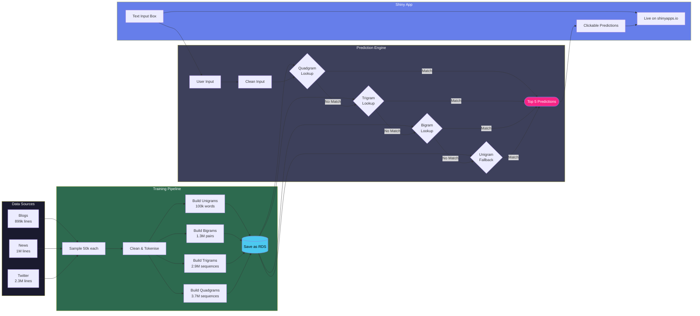

 _  _ ____ _  _ ___    _ _ _  ____ ____ ____    ___  ____ ____ ___  _ ____ ___ ____ ____ 
 |\ | |___  \/   |     | | |  |  | |__/ |  \    |__] |__/ |___ |  \ | |     |  |  | |__/ 
 |  \| |___ _\/_ |     |_|_|  |__| |  \ |__/    |    |  \ |___ |__/ | |___  |  |__| |  \

A SwiftKey style next word prediction app built with R, trained on 150,000 lines of real English text from blogs, news and Twitter.

## Live Links
- **Shiny App:** https://jjvqgo-farhan-bin.shinyapps.io/next-word-predictor/
- **EDA Report:** https://rpubs.com/keo/word_prediction
- **Slide Deck:** https://rpubs.com/keo/1452578

## Screenshot

## System Architecture

## How It Works
Uses a Stupid Backoff N-gram model with 4 layers:
1. Quadgrams (3,707,806 sequences)
2. Trigrams (2,997,658 sequences)
3. Bigrams (1,361,416 pairs)
4. Unigram fallback (100,501 words)

## Training Data (SwiftKey Dataset)
| Source  | Lines     | Avg Words/Line |
|---------|-----------|----------------|
| Blogs   | 899,288   | 42 words       |
| News    | 1,010,242 | 35 words       |
| Twitter | 2,360,148 | 12 words       |

## Tech Stack
- R, Shiny, tidytext, dplyr, ggplot2
- Deployed on shinyapps.io
- Report published on RPubs

## Course
Johns Hopkins Data Science Capstone — Coursera